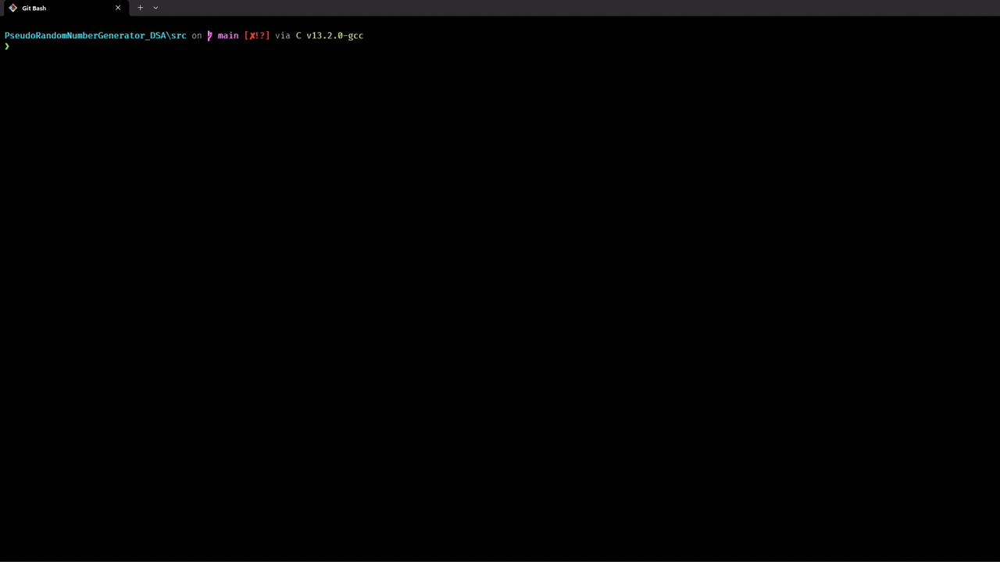

# Pseudo-Random Number Generator and Quicksort Demonstration

This project is my submission for the assignment of implementing the quicksort algorithm and executing it on 1000 randomly generated numbers (along with the optional side-quest of implementing pseudo-random number generators).  

Admittedly, `C` is not quite my forte when it comes to working in implementing stuff in multiple files, hence I had a lot of fun adding this as an additional challenge. 🙃

### Interface Demo


## How It Works
1. **Selection:** The user selects one of three PRNG algorithms via the CLI.
2. **Configuration:** The user inputs a seed (default: `42`) and the quantity of integers to generate.
3. **Generation:** The program generates the requested number of integers.
    - *Note: Expander Graph (64-bit) outputs are cast to 32-bit for uniformity.*
4. **Sorting:** The array is sorted using a generic `quicksort` implementation.
5. **Output:** Results are printed to `prng_report.txt`.

## Project Architecture

The source code is located in the [`/src`](./src/) directory:

* [**`main.c`**](./src/main.c): The entry point. Handles user input, allocates memory, and orchestrates the generation/sorting flow.
* **`pseudoRNG.c/h`**: Implements the random number generators:
    * **LCG**: Standard Linear Congruential Generator.
    * **Middle Square**: Von Neumann's method (educational, fragile with small seeds).
    * **Expander Graph**: A chaotic map implementation using Arnold's Cat Map and Xorshift. (My own personally made PRNG! THIS WAS SO COOL 🎉)
* **`quicksort.c/h`**: A generic sorting implementation using `void*` pointers and memory swapping to handle any data type. Truly proud of writing this 😎 ~~(learnt function pointers for this!)~~.

## Sample Results (Seed: 1337)
Sample outputs generated using the seed `1337` with 1000 inputs are available in the root directory:

* [Linear Congruential Generator (LCG)](./LCG_Report.txt)
* [Middle Square Method (MSM)](./Middle_Square_Report.txt)
* [Expander Graph](./ExpanderGraph_Report.txt)

> This was essentially an exhibition of the fragility of MSM 🙂

## Build & Run

### 1. Compile
Navigate to the source directory and compile using `gcc`.

```bash
cd src
gcc main.c pseudoRNG.c quicksort.c -o prng_app
```

### 2. Usage
Run the executable and follow the onscreen prompts!

```bash
./prng_app
```

### 3. Output
The program will generate a file named `prng_report.txt` in the working directory containing the simulation details, the random sequence, and the sorted sequence.
